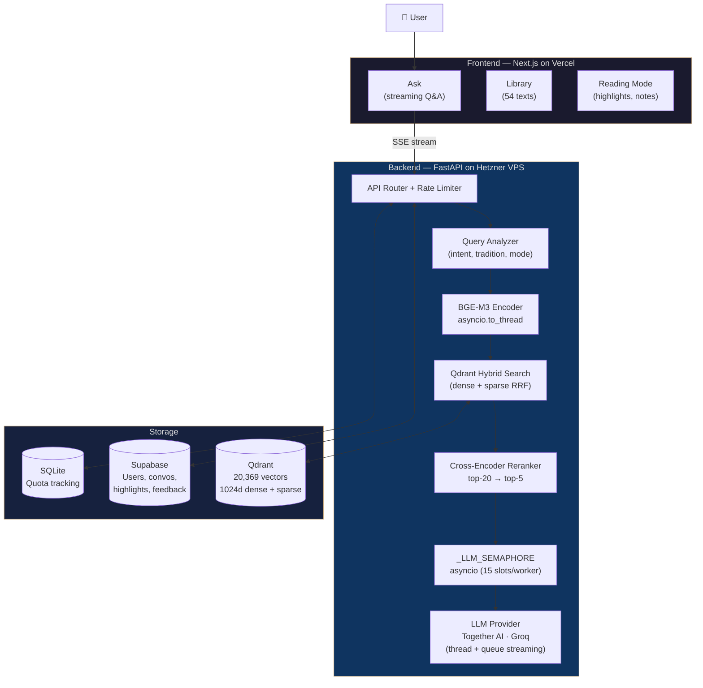
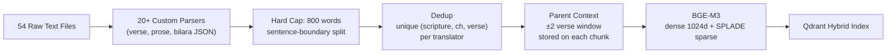
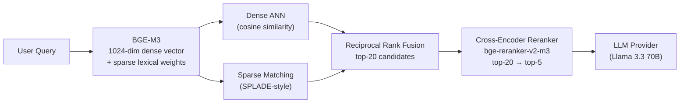
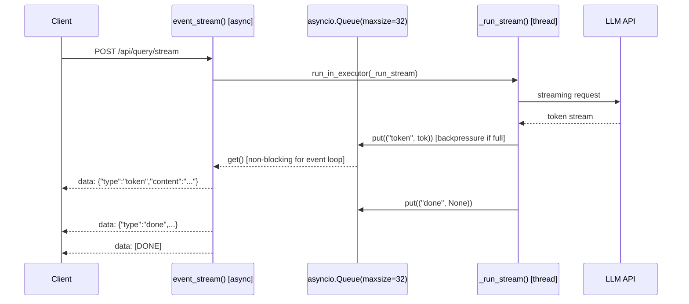

# AntarDarshan — Engineering

<div align="center">

[](https://github.com/sharanharsoor/antardarshan)

[](#testing)
[](#evaluation)
[](#the-corpus--the-real-engineering-problem)
[](#tech-stack)
[](LICENSE)

*A deep dive into building a RAG system where the corpus is the product*

</div>

---

## Why This Exists

Most AI assistants know Indian philosophy the way someone knows a Wikipedia summary: plausible surface, no depth, no source. Ask about the Mandukya Upanishad's four states of consciousness, the Samyutta Nikaya's treatment of dependent origination, or where Shankara and Ramanuja actually disagree on the Brahma Sutras, and you get confident-sounding text with no grounding.

The interesting engineering problem: **how do you build a retrieval system that can reason across 54 classical texts, spanning 2,500 years and six philosophical traditions, with every answer traceable to an actual passage?**

This document is a walkthrough of the system — decisions, tradeoffs, things that broke, and what I'd do differently.

---

## Tech Stack

| Layer | Choice | Why |
|---|---|---|
| **Embedding** | BGE-M3 (1024d dense + sparse) | Single forward pass for hybrid vectors, no separate BM25 infrastructure |
| **Vector DB** | Qdrant (self-hosted) | Native hybrid search; Rust performance; $0 |
| **Reranker** | bge-reranker-v2-m3 (cross-encoder) | Reads (query, passage) jointly, much more accurate than embedding similarity alone |
| **LLM** | Llama 3.3 70B via Together AI (Groq fallback) | Configurable provider; ~3-8s to first token; handles multi-tradition synthesis |
| **Backend** | FastAPI + asyncio | Full async with thread-pool offloading for blocking calls |
| **Frontend** | Next.js 14 App Router | Server components + streaming SSE |
| **Auth + DB** | Supabase (PostgreSQL + RLS) | Row-level security per user; free tier generous enough |
| **Hosting** | Hetzner VPS + Vercel + Cloudflare | $6/month backend; free CDN+DDoS; free frontend |

---

## System Architecture



---

## The Corpus — The Real Engineering Problem

The single highest-leverage decision was treating **corpus curation as a first-class engineering problem**, not an afterthought.

### Scale

| Tradition | Texts | Chunks |
|---|---|---|
| Hindu Vedanta | All 13 principal Upanishads, Bhagavad Gita (×2), Ashtavakra Gita, Vivekachudamani, Brahma Sutras (×3 commentaries) | ~5,500 |
| Hindu Epics & Vedas | Mahabharata (complete), Ramayana, Rig Veda, Atharva Veda | ~6,800 |
| Hindu Philosophy | Arthashastra, Manu Smriti, Nyaya, Vaisheshika, Samkhya | ~1,800 |
| Buddhist | 4 Pali Nikayas + Dhammapada + Sutta Nipata + Udana + Therigatha + Theragatha + Itivuttaka + Milindapanha | ~5,200 |
| Jain & Sant/Bhakti | Jain Sutras, Songs of Kabir, Thirukkural, Psalms of Maratha Saints | ~1,300 |

All texts are **public domain (pre-1928) or CC0**. Full source attribution and license proof documented in [`CORPUS.md`](CORPUS.md).

### The Chunking Problem

Standard RAG tutorials chunk at 256-512 tokens. For dense philosophical prose, a 512-token chunk cuts arguments mid-thought. We discovered this the hard way: a Ramayana canto was being stored as a **single 15,432-word chunk** (silently truncated by BGE-M3's 8,192-token context window).

The fix is an **800-word hard cap** with sentence-boundary splitting:

```python
def _split_large_chunk(chunk, max_words=800):
    sentences = re.split(r'(?<=[.!?])\s+', chunk.text)
    raw_parts = []
    current, current_words = [], 0
    for sent in sentences:
        sent_words = len(sent.split())
        if sent_words > max_words:
            # Single sentence too long (OCR no-punctuation) — word-count fallback
            if current:
                raw_parts.append(" ".join(current))
                current, current_words = [], 0
            raw_parts.extend(_word_slice(sent, max_words))
        elif current_words + sent_words > max_words and current:
            raw_parts.append(" ".join(current))
            current, current_words = [sent], sent_words
        else:
            current.append(sent); current_words += sent_words
    ...
```

The corpus pipeline:



---

## The RAG Pipeline

### Why Hybrid (Dense + Sparse)?

Pure dense retrieval fails on exact-term queries. Ask "what does the Katha Upanishad say about *Nachiketa*?" and dense retrieval finds semantically similar passages about death/immortality, but may miss verses where the name appears. BM25-style sparse retrieval catches the exact term.

BGE-M3 was chosen specifically because it generates **both dense and sparse vectors in a single forward pass**: no separate BM25 index, no fusion infrastructure. One model, one pass, both signals.



### Query Analysis Layer

Not every query hits the RAG pipeline. Before retrieval, each query is classified:

| Mode | Trigger | Behavior |
|---|---|---|
| `citation` | Direct philosophical question | Full RAG → cited answer |
| `well_being` | Personal struggle ("I feel...") | Full RAG → empathetic framing before citations |
| `comparison` | Cross-tradition question | RAG across all traditions + synthesis |
| `conversational` | Follow-up, clarification | **Skip RAG** — answer from conversation history |

Skipping RAG on conversational follow-ups saves 2-5 seconds per exchange and avoids retrieval noise on questions like "what did you mean by that?"

---

## Async Architecture — The Hard Part

The original implementation blocked the event loop on every slow call: embedding, reranking, Supabase auth checks, LLM API calls. One 15-second LLM call would stall all other requests on that worker.

The refactor runs **every blocking call in a thread pool**:

```python
# Before: blocks event loop
user_id = verify_jwt(token)
hits = search(query, top_k=5)
answer = generate_response(...)

# After: event loop stays live
user_id = await asyncio.to_thread(verify_jwt, token)
hits     = await asyncio.to_thread(search, query, top_k=5)
answer   = await asyncio.to_thread(generate_response, ...)
```

The **LLM semaphore** prevents 100 concurrent users from all hitting the LLM provider simultaneously:

```python
_LLM_SEMAPHORE = _TrackedSemaphore(15)  # 15 concurrent LLM calls per worker

async with _LLM_SEMAPHORE:
    answer = await asyncio.to_thread(generate_response, ...)
```

### Streaming: Thread + Queue Pattern

The streaming endpoint is the most interesting part. The LLM client (Together AI / Groq) is synchronous, so running it directly in an async generator would block the event loop on every `next()` call during token generation.

The solution: run the generator in a thread pool and pass tokens through a bounded `asyncio.Queue`:



`maxsize=32` provides **backpressure**: if the client network is slow, the producer thread blocks on `fut.result()` instead of buffering unbounded tokens. A 45-second `wait_for` on the queue handles the case where the LLM provider stalls on a slow request rather than returning a fast 429.

---

## Phase 1 — What's Shipped

<details>
<summary>Full feature list (click to expand)</summary>

| Feature | Status |
|---|---|
| Citation-grounded Q&A with streaming | ✅ |
| 54 texts, 20,369 chunks, all 6 traditions | ✅ |
| All 13 principal Upanishads | ✅ |
| Complete Mahabharata + Ramayana | ✅ |
| Full Pali Canon (4 Nikayas + 5 minor texts) | ✅ |
| Hybrid RAG: BGE-M3 + cross-encoder reranker | ✅ |
| Multi-turn conversation with history | ✅ |
| Reading library with 54 readable texts | ✅ |
| Highlights + notes in reading mode | ✅ |
| Bookmarks | ✅ |
| User profiles + reading history | ✅ |
| Community Wisdom Wall | ✅ |
| Book feedback (thumbs up/down) | ✅ |
| Text issue reporting from reading view | ✅ |
| 503 retry banner + streaming error recovery | ✅ |
| 600 tests (496 backend + 104 frontend) | ✅ |
| Retrieval eval: 25/25 (100%) | ✅ |

</details>

---

## Scaling

<details>
<summary><strong>Phase 1 — Current ($6/month)</strong></summary>

```
Users
  ↓
Cloudflare (DNS, CDN, DDoS) — free
  ↓
Vercel (Next.js) — free
  ↓
Hetzner CX22 ($6/month)
  ├── uvicorn/Gunicorn (1-4 workers)
  ├── BGE-M3 in memory (~1GB FP16)
  ├── bge-reranker in memory (~500MB)
  └── Qdrant in Docker (persistent)
  ↓
Together AI — Llama 3.3 70B (pay-as-you-go)
Supabase — free tier
```

Practical limit: ~20-50 simultaneous users. Together AI rate limits and per-query cost are the first ceilings. Tune `GLOBAL_DAILY_LIMIT` to match your billing budget.

</details>

<details>
<summary><strong>Phase 2 — 10x traffic (~$20/month)</strong></summary>

Key changes:
- **Higher LLM tier or cheaper model** for high-volume queries — removes the rate ceiling
- **Redis for session store** — current in-memory sessions break under multi-worker Gunicorn; Redis gives TTL-based sharing across workers
- **Hetzner CX32** (4 vCPU, 8GB) — 4 Gunicorn workers, BGE-M3 FP16 per worker

</details>

<details>
<summary><strong>Phase 3 — 100x traffic (~$100-200/month)</strong></summary>

At this scale, **BGE-M3 CPU encoding** becomes the bottleneck at 2-5s per query, before LLM rate limits. Options:

- **ONNX-quantized BGE-M3** — 3x faster inference, half RAM, no GPU needed
- **GPU inference** — 10x faster, meaningful cost
- **Horizontal VPS scaling** — 3× servers behind Cloudflare load balancer, Qdrant Cloud for shared vector index

What doesn't change: Qdrant queries (<100ms), corpus pipeline (offline), Next.js frontend (serverless on Vercel).

</details>

---

## Design Decisions Worth Discussing

<details>
<summary><strong>Why not OpenAI embeddings?</strong></summary>

`text-embedding-3-large` scores ~64.6 on MTEB vs 64.3 for BGE-M3: essentially identical. But BGE-M3 generates dense + sparse in one pass (eliminating separate BM25 infrastructure), runs locally (no per-query cost, no external dependency for retrieval), and has stronger multilingual coverage for Sanskrit-adjacent philosophical English. The marginal quality gap doesn't justify the ongoing cost and external dependency.

</details>

<details>
<summary><strong>Why self-hosted Qdrant over Pinecone?</strong></summary>

Qdrant supports **native hybrid search** (dense + sparse in a single query with built-in RRF). Pinecone requires separate indexes with manual fusion. At our scale (~20K vectors), Qdrant in Docker costs $0 and the Rust performance gives <100ms vector search. The operational overhead is minimal for a solo project.

</details>

<details>
<summary><strong>Why 800-word chunks instead of 512 tokens?</strong></summary>

Upanishadic arguments and Pali sutta discourses develop ideas over 200-400 words. A 512-token (~380 word) chunk cuts philosophical arguments mid-proof. 800 words keeps complete ideas intact while staying semantically focused for the embedding. Anything larger and the chunk represents too many distinct ideas for a single vector.

</details>

<details>
<summary><strong>Why Llama 3.3 70B over GPT-4?</strong></summary>

Together AI's Llama 3.3 70B gives ~3-8s to first token with strong citation quality. GPT-4 costs 10-50x more per query for marginal gains on this domain. The provider is configurable: set `TOGETHER_API_KEY` for Together AI or `GROQ_API_KEY` for Groq. Both use the same OpenAI-compatible streaming interface, so swapping is one env var change.

</details>

---

## Evaluation

```bash
python -m eval.run_eval
# Runs 25 benchmark queries against the live backend
# RESULTS: 25/25 passed (100%) — Citation: 20/20 | Well-being: 5/5
```

Queries cover: direct philosophy ("What is consciousness?"), cross-tradition ("How does Vedanta differ from Buddhism on the self?"), quote-grounded ("hatred is never laid to rest by hate"), personal ("I feel lost and don't know my purpose"), and textual ("karma yoga nishkama").

---

## Testing

```bash
python -m pytest tests/ -q    # 496 backend tests
cd frontend && npm run test    # 104 frontend tests
```

Key coverage: streaming timeout and error events, `_TrackedSemaphore` concurrency, chunk quality gate (hard cap enforcement), readable scriptures registry, Khuddaka Nikaya parsers, book feedback and issue reporting, health check dependency probing.

---

## What I'd Do Differently

**Async from day one.** The blocking I/O refactor was correct but retrofitted. A greenfield build uses an async LLM client and async Qdrant from the start, with no `asyncio.to_thread` wrapping needed.

**Streaming corpus ingestion.** The 15MB Mahabharata loads entirely into memory during parsing. A generator-based parser handles arbitrarily large texts without RAM spikes.

**Structured LLM output.** The follow-up question parser uses regex on free-form text. Structured outputs mode with a Pydantic schema would be more reliable.

**Corpus is the product.** The biggest quality gains came from corpus work, not prompt tuning. Adding the Aitareya, Kaushitaki, and Maitri Upanishads improved philosophical depth more than any retrieval parameter change. Future investment goes there first.

---

<div align="center">

*If you're building something in this space — RAG for specialized domains, hybrid retrieval, async streaming architectures — I'd like to talk.*

**[Connect on LinkedIn](https://www.linkedin.com/in/sharan-harsoor/) · [GitHub](https://github.com/sharanharsoor)**

</div>
