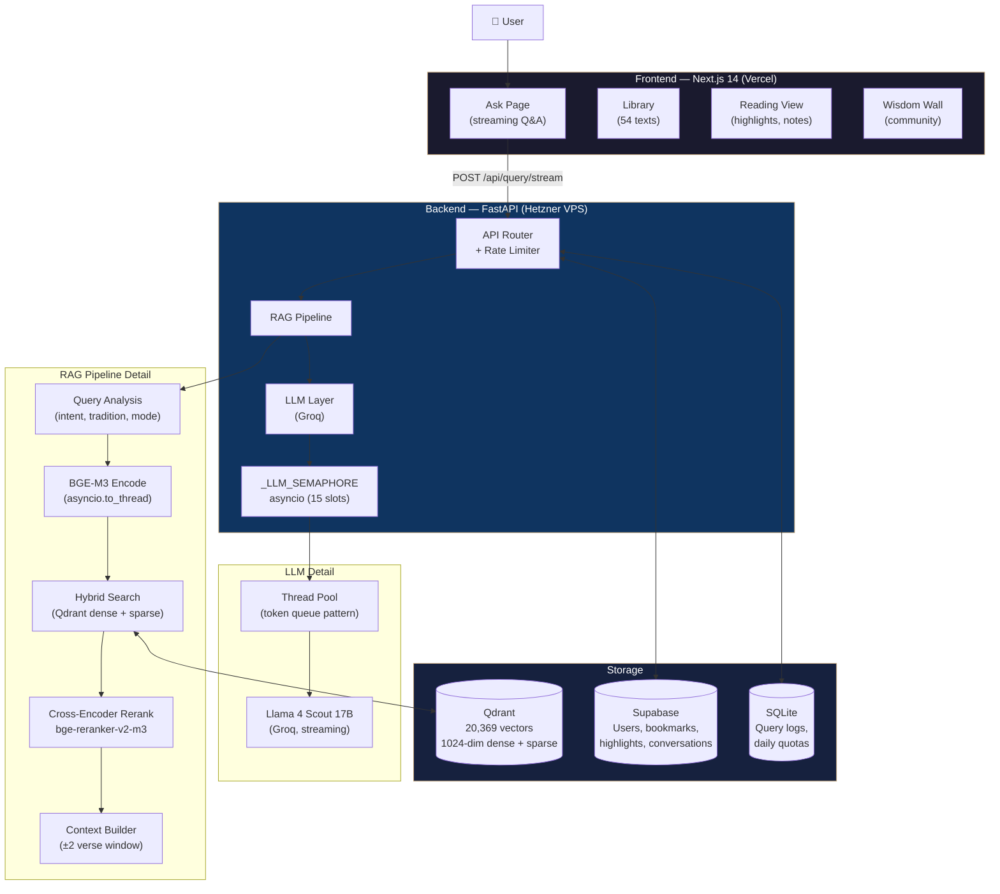
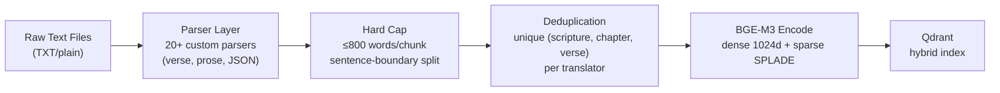
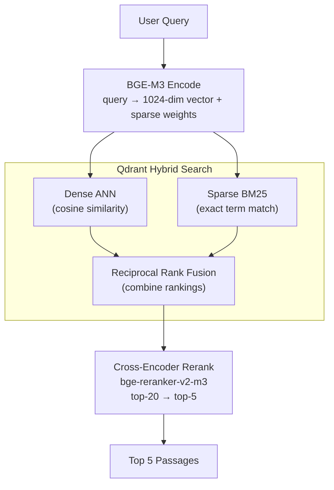

# AntarDarshan — Engineering Deep Dive

> A technical narrative of building a citation-grounded AI assistant for Indian philosophy — from corpus design to production architecture.

[](#testing)
[](#evaluation)
[](#the-corpus)
[](#tech-stack)

---

## The Problem

Most AI assistants are trained on internet text, which means their knowledge of Indian philosophy is shallow, inconsistent, and uncited. Ask ChatGPT about the Mandukya Upanishad or the Therigatha — you get plausible-sounding summaries with no source. Ask it to quote the Ashtavakra Gita accurately — you often get paraphrases or confabulations.

Indian philosophical tradition is vast, interconnected, and deeply textual. The Bhagavad Gita has 18 chapters and multiple major translations. The Pali Canon has 11,000+ suttas. The Brahma Sutras have two major commentaries (Shankara and Ramanuja) that reach opposite conclusions. A useful tool needs to handle all of this with **precision and attribution** — not vague summaries.

AntarDarshan is built on one principle: **every answer must cite an actual passage from an actual text**. If we can't find it in the corpus, we don't fabricate it.

---

## System Architecture



---

## The Corpus

The most important engineering decision was building the corpus before writing a single line of application code. The quality of retrieval is bounded by the quality of source texts.

### Sources and Licensing

All 54 texts are public domain (pre-1928) or CC0. No copyrighted material.

| Tradition | Texts | Primary Sources |
|---|---|---|
| Hindu Vedanta | All 13 principal Upanishads, Bhagavad Gita (×2 translations), Ashtavakra Gita, Vivekachudamani, Brahma Sutras (×3) | Müller SBE (1879–1904), Arnold (1885), Madhavananda (1921) |
| Hindu Yoga | Yoga Sutras, Vivekananda (Raja/Karma/Jnana-Yoga) | Johnston (1912), Vivekananda d.1902 |
| Hindu Epics | Mahabharata, Ramayana | Ganguli (1883–96), Griffith (1895) |
| Hindu Vedas | Rig Veda, Atharva Veda | Griffith (1896, 1895) |
| Hindu Philosophy | Nyaya Sutras, Vaisheshika Sutras, Samkhya Karika, Arthashastra, Manu Smriti | Vidyabhusana (1913), Sinha (1923), Colebrooke (1837) |
| Buddhist | 4 Pali Nikayas + 5 Khuddaka texts + Dhammapada + Milindapanha | Sujato CC0 (SuttaCentral), Rhys Davids (1890) |
| Jain | Jain Sutras Parts 1 & 2 | Jacobi SBE (1884, 1895) |
| Sant/Bhakti | Songs of Kabir, Thirukkural, Psalms of Maratha Saints | Tagore (1915), Pope (1886), Macnicol (1919) |

### Corpus Pipeline



**Key decisions:**
- **800-word hard cap** — BGE-M3's context window is 8192 tokens (~6,300 words). We cap at 800 to keep each chunk semantically focused. The Ramayana had a 15,432-word chunk (a single canto) that was being silently truncated. The cap splits on sentence boundaries with a word-count fallback for OCR text with no punctuation.
- **Parent context** — each chunk stores ±2 verse window at embedding time, giving the LLM surrounding context without expanding retrieval chunk size.
- **Multiple translations as separate chunks** — Bhagavad Gita has Arnold (1885) and Telang (1882). Both are indexed. The reranker picks whichever is more relevant to the query.

---

## The RAG Pipeline

### Step 1: Query Analysis

Before retrieval, every query is analyzed to extract:
- **Intent mode**: `citation` (philosophical question) | `well_being` (personal struggle) | `conversational` (follow-up) | `comparison` (cross-tradition)
- **Scripture filter**: if query mentions "Gita" or "Dhammapada", retrieval is biased toward that text
- **Reading mode**: if the user is reading a specific book, retrieval is book-first

Conversational follow-ups ("what did you mean?", "tell me more") skip RAG entirely — they're answered from conversation history, saving 2-5 seconds per follow-up.

### Step 2: Hybrid Retrieval



**Why hybrid (dense + sparse)?**

Dense-only retrieval fails on exact term queries. If you ask "what does the Ashtavakra Gita say about *videhamukti*?" — dense retrieval finds semantically similar passages about liberation, but might miss the exact Sanskrit term. Sparse retrieval (BM25-style lexical matching) catches the exact term. Hybrid fusion takes the best of both.

BGE-M3 was chosen because it generates both dense and sparse vectors in a single forward pass — no separate BM25 infrastructure needed.

### Step 3: Reranking

The top-20 retrieved passages are re-scored by `bge-reranker-v2-m3`, a cross-encoder that reads (query, passage) pairs jointly — much more accurate than embedding similarity alone, but too slow to run on the full index. The final top-5 go to the LLM.

---

## The Async Architecture

The original naive implementation blocked the event loop on every LLM call. A single 15-second Groq call would freeze all other requests on that worker — effectively making the server single-threaded.

The fix was a complete async refactor:

```python
# Everything blocking moved to thread pool
user_id = await asyncio.to_thread(verify_jwt, token)
quota_ok = await asyncio.to_thread(check_user_quota, user_id)
hits     = await asyncio.to_thread(search, query, top_k=5)  # BGE-M3 + reranker
answer   = await asyncio.to_thread(generate_response, ...)   # Groq HTTP

# LLM concurrency cap — prevents runaway Groq usage and CPU saturation
async with _LLM_SEMAPHORE:  # asyncio.Semaphore(15) per worker
    answer = await asyncio.to_thread(generate_response, ...)
```

**Streaming with thread+queue pattern:**

The streaming endpoint runs `generate_response_stream()` in a thread pool (since the Groq streaming client is sync) and pushes tokens through an `asyncio.Queue(maxsize=32)`:

```python
async def event_stream():
    token_queue: asyncio.Queue = asyncio.Queue(maxsize=32)
    stop_event = threading.Event()

    def _run_stream():
        # Runs in thread pool — never blocks event loop
        for token in groq_stream:
            if stop_event.is_set(): break
            fut = asyncio.run_coroutine_threadsafe(
                token_queue.put(("token", token)), loop
            )
            fut.result(timeout=5.0)  # backpressure for slow clients

    async with _LLM_SEMAPHORE:
        gen_future = loop.run_in_executor(None, _run_stream)
        while True:
            try:
                event_type, payload = await asyncio.wait_for(
                    token_queue.get(), timeout=45.0  # no infinite hang
                )
            except asyncio.TimeoutError:
                stop_event.set()
                yield error_event("timed out")
                break
            if event_type == "done": break
            yield token_event(payload)
        await asyncio.wait_for(gen_future, timeout=5.0)
```

The `maxsize=32` queue provides backpressure — if the client is slow (slow network), the producer thread blocks on `fut.result()` instead of buffering unbounded tokens. The `stop_event` ensures clean exit on client disconnect.

---

## LLM Integration

**Model:** Llama 4 Scout 17B on Groq (free tier: 14,400 requests/day)

**Why Groq?** Inference is ~5-10x faster than self-hosted models of similar size. At 17B parameters, Scout handles multi-tradition philosophical synthesis better than 8B while still fitting Groq's free tier quota.

**System prompt strategy:** Three modes with different prompts:
- `citation` — structured Markdown with numbered citations, synthesis section
- `well_being` — conversational, starts with empathy before citing texts
- `conversational` — responds from conversation history, no RAG

**Context construction:**

```
[System: mode-specific instructions]
[Conversation history: last N messages, token-aware via llm-smartmem]
[Retrieved passages: top-5 with scripture, chapter, verse, translator]
[User query]
```

Token-aware history management via `llm-smartmem` ensures we never exceed Groq's context window even in long conversations.

---

## Phase 1 — What's Shipped

| Feature | Status |
|---|---|
| Citation-grounded Q&A (streaming) | ✅ Live |
| 54 texts, 20,369 chunks, all traditions | ✅ Live |
| All 13 principal Upanishads | ✅ Live |
| Full Mahabharata + Ramayana | ✅ Live |
| 5 Khuddaka Nikaya Buddhist texts | ✅ Live |
| Hybrid RAG (BGE-M3 dense + sparse + reranker) | ✅ Live |
| Conversation history (multi-turn) | ✅ Live |
| Reading library (54 readable texts) | ✅ Live |
| Highlights + notes in reading mode | ✅ Live |
| Bookmarks | ✅ Live |
| User profiles + reading history | ✅ Live |
| Wisdom Wall (community) | ✅ Live |
| Book feedback (thumbs up/down) | ✅ Live |
| Text issue reporting | ✅ Live |
| 503 retry banner + streaming timeout recovery | ✅ Live |
| 496 backend + 104 frontend tests | ✅ Live |
| Retrieval eval: 25/25 (100%) | ✅ Live |

---

## Scaling Architecture

<details>
<summary><strong>Current state (Phase 1) — single VPS</strong></summary>

```
Users → Cloudflare (DNS, CDN, DDoS)
      → Vercel (Next.js frontend)
      → Hetzner CX22 $6/month:
            uvicorn (1 worker on Mac dev, 4 workers on Linux VPS)
            Qdrant (Docker, persistent)
            BGE-M3 model in memory (~1GB FP16)
            BGE reranker in memory (~500MB)
      → Groq API (Llama 4 Scout 17B)
      → Supabase (auth, user data)
```

**Practical capacity:** ~20-50 simultaneous active users on free Groq tier.

</details>

<details>
<summary><strong>Phase 2 — if traffic grows 10x</strong></summary>

```
Users → Cloudflare
      → Vercel (auto-scales, no change)
      → Hetzner CX32 (4 vCPU, 8GB) — $16/month:
            4 Gunicorn workers (Linux, no Metal/fork issue)
            Redis for session sharing across workers
            Qdrant (separate container or Qdrant Cloud)
      → Groq Developer/Paid tier (600 RPM vs 30 RPM)
```

**Session sharing:** The current in-memory session store is per-process. Under Gunicorn multi-worker on Linux, multi-turn conversations break if requests hit different workers. Redis TTL-based session store fixes this.

</details>

<details>
<summary><strong>Phase 3 — if traffic grows 100x</strong></summary>

```
Users → Cloudflare Load Balancer
      → 3× Hetzner VPS (horizontal scale)
      → Qdrant Cloud (dedicated, replicated)
      → Groq Enterprise or self-hosted Llama on GPU
      → Redis Cluster
```

**The real bottleneck at scale:** BGE-M3 encoding is CPU-bound. Each query runs encode + rerank, taking 2-5 seconds on CPU. At 100x scale, this becomes the bottleneck before Groq rate limits do. Options: ONNX-quantized BGE-M3 (3x faster inference, half RAM), or GPU inference (10x faster, significant cost).

**What doesn't need to change:** The Qdrant query itself is fast (<100ms). The corpus pipeline runs offline. The Next.js frontend is stateless and scales on Vercel for free.

</details>

---

## Design Decisions and Tradeoffs

<details>
<summary><strong>Why not use OpenAI embeddings?</strong></summary>

OpenAI `text-embedding-3-large` scores marginally higher on MTEB benchmarks (~64.6 vs 64.3 for BGE-M3). But BGE-M3 generates both dense and sparse vectors in one forward pass — eliminating the need for separate BM25 infrastructure. BGE-M3 also has stronger multilingual coverage, important for Sanskrit-adjacent philosophical English. And it runs locally — no per-query cost, no external dependency for retrieval.

</details>

<details>
<summary><strong>Why Qdrant over Pinecone/Weaviate?</strong></summary>

Qdrant supports native hybrid search (dense + sparse vectors in a single query). Pinecone's hybrid requires separate indexes with manual RRF fusion. Weaviate's hybrid is good but Qdrant's Rust performance at our scale (~20K vectors) makes it the fastest cold-start option. Self-hosted Qdrant in Docker costs $0 and gives full control.

</details>

<details>
<summary><strong>Why chunk at 800 words instead of a standard 512 tokens?</strong></summary>

Standard RAG tutorials chunk at 256-512 tokens. For dense philosophical prose (Upanishads, Brahma Sutras), each "idea" takes 200-400 words to develop — a 512-token chunk cuts arguments mid-thought. We chose 800 words (~1,040 tokens) as the upper bound: long enough to capture complete philosophical arguments, short enough for the embedding to remain semantically focused. Chunks are sentence-boundary split, with word-count fallback for OCR text with no punctuation.

</details>

<details>
<summary><strong>Why Groq + Llama 4 Scout instead of GPT-4?</strong></summary>

Groq's inference speed (often <2 seconds to first token) matters for streaming UX. GPT-4 is slower and costs ~10-50x more per query. Llama 4 Scout 17B handles multi-tradition philosophical synthesis well — enough nuance to distinguish Advaita from Vishishtadvaita, to note where Buddhist and Vedantic conceptions of self diverge. At this scale and budget, the quality tradeoff is acceptable and the cost is near-zero.

</details>

---

## Evaluation

25 benchmark queries covering citation mode (20) and well-being mode (5), run against the live backend:

```
python -m eval.run_eval
```

Queries include:
- Direct philosophy: "What is the nature of the self?"
- Cross-tradition: "How does Buddhism view suffering?"
- Quote-grounded: "hatred is never laid to rest by hate"
- Personal: "I feel lost and don't know my purpose"
- Textual: "karma yoga nishkama"

**Current result: 25/25 (100%)** — maintained across all corpus and architecture changes.

---

## Testing

```bash
python -m pytest tests/ -q     # 496 backend tests
cd frontend && npm run test     # 104 frontend tests
```

Key test areas:
- Stream timeout and error event handling
- `_TrackedSemaphore` concurrency tracking
- Chunk quality (hard cap enforcement, no oversized chunks)
- Readable scriptures registry (all 13 Upanishads, Mahabharata, etc.)
- KN sub-collections parsing (Sutta Nipata, Udana, Therigatha, etc.)
- Book feedback and issue reporting endpoints
- Health check dependency probing (503 when Qdrant down)

---

## What I Would Do Differently

1. **Async from day one.** The blocking I/O refactor (moving BGE-M3 and Groq calls to `asyncio.to_thread`) was correct but retrofitted. A greenfield build would use an async Groq client and async Qdrant from the start.

2. **Streaming corpus ingestion.** The 15MB Mahabharata was loaded entirely into memory during parsing. A generator-based parser would handle arbitrarily large texts without RAM spikes.

3. **Structured output from the LLM.** The current parsing of follow-up questions (`_parse_follow_ups`) uses regex on free-form text. Groq supports structured outputs — parsing would be more reliable with a Pydantic schema.

4. **The corpus is the product.** The biggest quality gains came from corpus work (adding Aitareya, Kaushitaki, Maitri Upanishads; proofread Mahabharata from sacred-texts.com) — not from tuning the LLM prompt. Future investment should go there first.

---

*Built by [Sharan Harsoor](https://github.com/sharanharsoor) — 2026*
