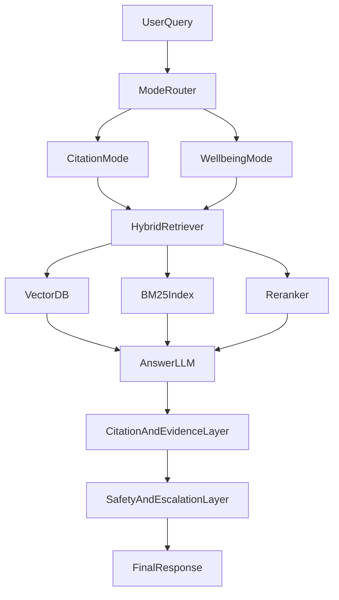

# Indian Philosophy Assistant: MVP Plan

## Product Stance (Critic View)
- Build this as a **grounded retrieval product first**, not a foundation-model-training project.
- With a **lean budget** and tri-language scope, full fine-tuning a 7B model is not the right first move.
- `100 GPUs on Colab` is not a reliable production training strategy (ephemeral sessions, throughput instability, storage/ops overhead).
- For V1, use strong base models + domain retrieval + strict citation UX + safety routing.

## Data Strategy (Most Important Decision)

### Tier A: Use Immediately (Low legal risk with compliance)
- Public-domain scripture and classical translations from sources like Project Gutenberg and public-domain Internet Archive items.
- CC-licensed corpora where license obligations are acceptable (for example, attribution/share-alike workflows).
- Candidate registry and ingestion specs in:
  - [docs/data-source-registry.md](docs/data-source-registry.md)
  - [docs/data-licenses.md](docs/data-licenses.md)

### Tier B: Conditional Use (Allowed only per explicit terms)
- Sources with narrow grants (example: specific downloadable media programs with attribution and format limits).
- Ingest only after writing machine-readable policy rules and checks.
- Store policy gates in:
  - [policy/source-allowlist.yaml](policy/source-allowlist.yaml)
  - [policy/source-denylist.yaml](policy/source-denylist.yaml)

### Tier C: Exclude Until Contract/Permission
- `YouTube transcript scraping` and similar automated extraction from platforms that prohibit it.
- `Osho` and other disputed/strictly controlled rights without explicit license.
- Repositories with non-commercial-only terms if your product is public/commercial.

## Architecture Decision: RAG First, Fine-Tune Later

### Why this path
- RAG gives traceable answers and fast iteration on source quality.
- Fine-tuning before retrieval quality is stable usually amplifies hallucinations.
- Domain tuning should be stage-2 and narrow (instruction style, quote formatting, Sanskrit/Hindi transliteration behavior).

## Core System Components (V1)
- **Ingestion pipeline**: fetch, normalize Unicode, segment by verse/commentary/metadata, attach license provenance.
- **Storage**: relational metadata store + vector store + keyword index.
- **Retrieval**: hybrid search (semantic + lexical) with reranking.
- **Generation**: model prompted to answer only from retrieved evidence, with refusal on weak grounding.
- **Dual-mode orchestration**:
  - citation-first mode: strict references and confidence.
  - well-being mode: supportive tone but still grounded; crisis-safe escalation policy.
- **Evaluation harness**: benchmark for citation precision, faithfulness, harmful advice risk, multilingual quality.

## Lean-Budget Technical Defaults
- Use managed API LLM for generation in early stages; avoid hosting large custom model on day 1.
- Use multilingual embedding model suitable for English/Hindi/Sanskrit-transliterated content.
- Start with cost-efficient infra:
  - [infra/docker-compose.yml](infra/docker-compose.yml)
  - [infra/deploy.md](infra/deploy.md)
- Prefer one backend for web and mobile clients:
  - [backend/api/openapi.yaml](backend/api/openapi.yaml)
  - [apps/web/](apps/web/)
  - [apps/mobile/](apps/mobile/)

## Phase Plan

### Phase 0: Governance and Rights (Week 1)
- Build source registry with license tags, allowed transformations, attribution obligations, and removal workflow.
- Define legal-safe ingestion checklist before any crawl job.

### Phase 1: Data and Retrieval Foundation (Weeks 2-3)
- Ingest Tier A sources only.
- Build chunking and metadata schema (work, chapter, verse, translator, language, license).
- Ship hybrid retrieval + citation rendering endpoint.

### Phase 2: Product MVP (Weeks 4-5)
- Launch web app with two modes (Citation and Well-being).
- Add safety policies, crisis language detection, and escalation responses.
- Ship basic analytics and feedback loop.

### Phase 3: Mobile + Hardening (Weeks 6-8)
- Release mobile app backed by same APIs.
- Add offline caches for frequent passages.
- Add scholar review pipeline and source quality scoring.

### Phase 4: Domain Adaptation (Post-PMF)
- Consider small-scale LoRA/SFT only after evaluation shows repeated style/format errors that prompting cannot fix.
- Keep base reasoning model external until usage justifies dedicated inference stack.

## Critical Risks and Mitigations
- **Licensing risk**: enforce allowlist-first ingestion and per-document provenance tracking.
- **Hallucination risk**: answer only with retrieved evidence and show explicit citations.
- **Safety risk**: stress-support mode must avoid medical claims and escalate crisis language.
- **Scope risk**: tri-language quality can explode complexity; start with high-quality canonical subset first.

## Success Metrics (MVP)
- Citation precision on curated eval set.
- Faithfulness score (answer grounded in retrieved sources).
- Unsafe response rate in well-being scenarios.
- Cost per answered query and p95 latency.
- 30-day retention for repeat users.
